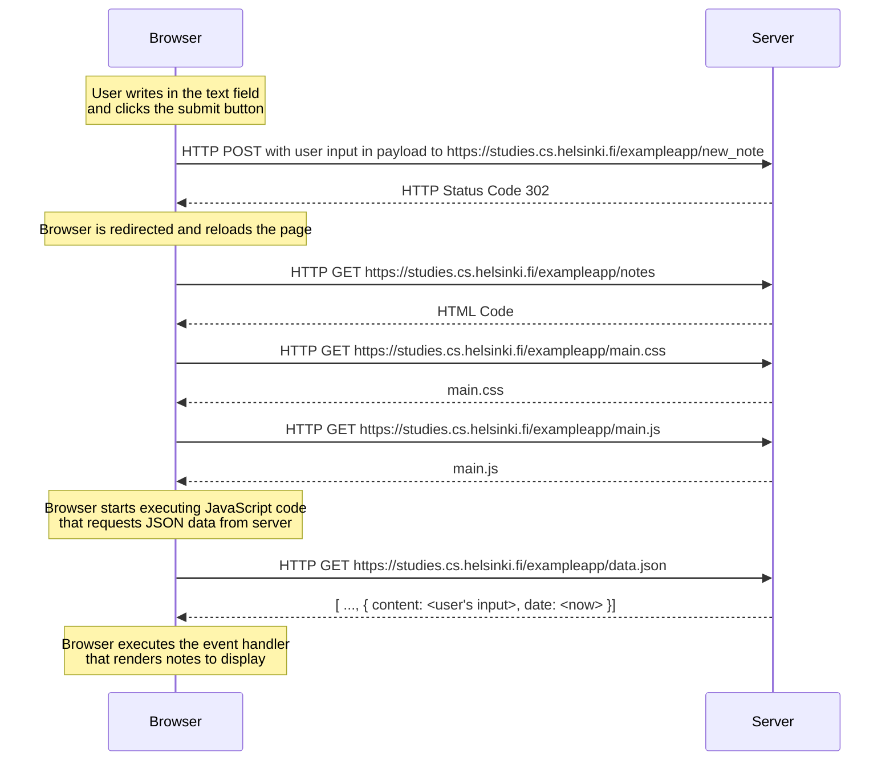

```mermaid
sequenceDiagram
  participant B as Browser
  participant S as Server
  Note over B: User writes in the text field<br> and clicks the submit button
  B->>S: HTTP POST with user input in payload to https://studies.cs.helsinki.fi/exampleapp/new_note
  S-->>B: HTTP Status Code 302
  Note over B: Browser is redirected and reloads the page
  B->>S: HTTP GET https://studies.cs.helsinki.fi/exampleapp/notes
  S-->>B: HTML Code
  B->>S: HTTP GET https://studies.cs.helsinki.fi/exampleapp/main.css
  S-->>B: main.css
  B->>S: HTTP GET https://studies.cs.helsinki.fi/exampleapp/main.js
  S-->>B: main.js
  Note over B: Browser starts executing JavaScript code<br> that requests JSON data from server
  B->>S: HTTP GET https://studies.cs.helsinki.fi/exampleapp/data.json
  S-->>B: [ ..., { content: <user's input>, date: <now> }]
  Note over B: Browser executes the event handler<br>that renders notes to display
```
