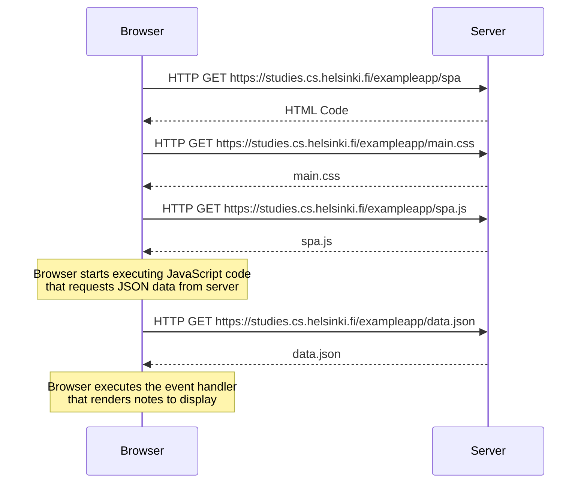

```mermaid
sequenceDiagram
  participant B as Browser
  participant S as Server
  B->>S: HTTP GET https://studies.cs.helsinki.fi/exampleapp/spa
  S-->>B: HTML Code
  B->>S: HTTP GET https://studies.cs.helsinki.fi/exampleapp/main.css
  S-->>B: main.css
  B->>S: HTTP GET https://studies.cs.helsinki.fi/exampleapp/spa.js
  S-->>B: spa.js
  Note over B: Browser starts executing JavaScript code<br>that requests JSON data from server
  B->>S: HTTP GET https://studies.cs.helsinki.fi/exampleapp/data.json
  S-->>B: data.json
  Note over B: Browser executes the event handler<br>that renders notes to display
```
