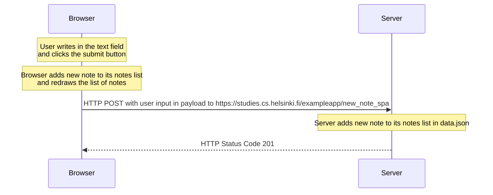

```mermaid
sequenceDiagram
  participant B as Browser
  participant S as Server
  Note over B: User writes in the text field<br>and clicks the submit button
  Note over B: Browser adds new note to its notes list<br>and redraws the list of notes
  B->>S: HTTP POST with user input in payload to https://studies.cs.helsinki.fi/exampleapp/new_note_spa
  Note over S: Server adds new note to its notes list in data.json
  S-->>B: HTTP Status Code 201
```
